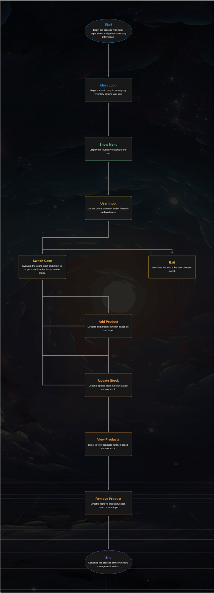

# Inventory Management System Project

## Step 1: Choosing a Design Challenge

I chose the **Inventory Management System**.

---

## Step 2: Defining the Project Requirements and Objectives

### Requirements

1. **Functional Requirements**:

   - Add new products with `name`, `price`, and `stock quantity`.
   - Update stock when products are sold or restocked.
   - View all products and their stock levels.
   - Remove products from inventory.

2. **Non-Functional Requirements**:
   - The application must be a console-based application.
   - The system must be user-friendly and respond within 2 seconds for any input.
   - Code should follow clean coding principles for readability and maintainability.

### Objectives

- Create a fully functional inventory management system.
- Ensure the application uses control structures, loops, and methods to achieve functionality.
- Make the application modular with proper method calls for adding, updating, viewing, and removing products.

---

## Step 3: Creating a Design Outline

### Planned Tasks

1. **Add New Product**:

   - Input: Product `name`, `price`, and `stock quantity`.
   - Output: Add product to the list.

2. **Update Stock**:

   - Input: Product `name` and stock change (+ or -).
   - Output: Update stock in the product list.

3. **View Products**:

   - Input: None.
   - Output: Display all products with their details.

4. **Remove Product**:
   - Input: Product `name`.
   - Output: Remove product from the list.

### Code Components

1. **Variables**:

   - A list to store product details (`List<Product>`).
   - Temporary variables for user input.

2. **Methods**:

   - `AddProduct()`
   - `UpdateStock()`
   - `ViewProducts()`
   - `RemoveProduct()`
   - `Main()` for the application entry point.

3. **Control Structures**:

   - Use `if-else` and `switch` for menu selection.

4. **Loops**:
   - Use a `while` loop for keeping the application running until the user exits.

### Flowchart

### Flowchart



---

## Step 4: Building the Application

### Code Implementation

```csharp
using System;
using System.Collections.Generic;

class Program
{
    static List<Product> products = new List<Product>();

    static void Main()
    {
        bool running = true;

        while (running)
        {
            Console.WriteLine("\nInventory Management System");
            Console.WriteLine("1. Add Product");
            Console.WriteLine("2. Update Stock");
            Console.WriteLine("3. View Products");
            Console.WriteLine("4. Remove Product");
            Console.WriteLine("5. Exit");
            Console.Write("Enter your choice: ");
            string choice = Console.ReadLine();

            switch (choice)
            {
                case "1":
                    AddProduct();
                    break;
                case "2":
                    UpdateStock();
                    break;
                case "3":
                    ViewProducts();
                    break;
                case "4":
                    RemoveProduct();
                    break;
                case "5":
                    running = false;
                    Console.WriteLine("Exiting the application.");
                    break;
                default:
                    Console.WriteLine("Invalid choice. Please try again.");
                    break;
            }
        }
    }

    static void AddProduct()
    {
        Console.Write("Enter product name: ");
        string name = Console.ReadLine();
        Console.Write("Enter product price: ");
        decimal price = Convert.ToDecimal(Console.ReadLine());
        Console.Write("Enter stock quantity: ");
        int stock = Convert.ToInt32(Console.ReadLine());

        products.Add(new Product { Name = name, Price = price, Stock = stock });
        Console.WriteLine("Product added successfully!");
    }

    static void UpdateStock()
    {
        Console.Write("Enter product name: ");
        string name = Console.ReadLine();

        Product product = products.Find(p => p.Name.Equals(name, StringComparison.OrdinalIgnoreCase));
        if (product != null)
        {
            Console.Write("Enter stock change (positive for restock, negative for sale): ");
            int change = Convert.ToInt32(Console.ReadLine());
            product.Stock += change;
            Console.WriteLine("Stock updated successfully!");
        }
        else
        {
            Console.WriteLine("Product not found!");
        }
    }

    static void ViewProducts()
    {
        Console.WriteLine("\nProduct List:");
        foreach (var product in products)
        {
            Console.WriteLine($"Name: {product.Name}, Price: {product.Price:C}, Stock: {product.Stock}");
        }
    }

    static void RemoveProduct()
    {
        Console.Write("Enter product name to remove: ");
        string name = Console.ReadLine();

        Product product = products.Find(p => p.Name.Equals(name, StringComparison.OrdinalIgnoreCase));
        if (product != null)
        {
            products.Remove(product);
            Console.WriteLine("Product removed successfully!");
        }
        else
        {
            Console.WriteLine("Product not found!");
        }
    }
}

class Product
{
    public string Name { get; set; }
    public decimal Price { get; set; }
    public int Stock { get; set; }
}
```
